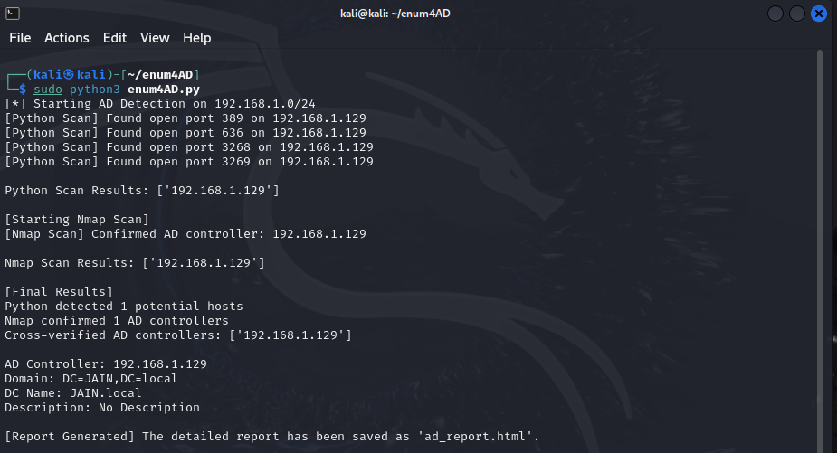
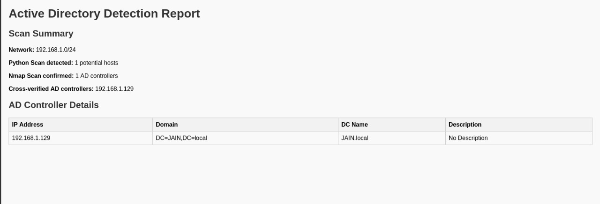

# enum4AD - Active Directory Enumeration Tool (Ongoing)

## Overview

**enum4AD** is a Python-based tool designed to detect and enumerate Active Directory Domain Controllers (AD DCs) in a given network. It performs scanning using Python socket connections and integrates with Nmap for advanced detection. The tool also retrieves domain controller details via LDAP queries and generates a structured HTML report.

## Features

- Scans the network for potential AD controllers using Python sockets.
- Uses Nmap to confirm AD controllers with `ldap-rootdse` NSE script.
- Retrieves domain information, DC name, and description via LDAP queries.
- Generates a detailed HTML report for analysis.

## Installation

Ensure the following dependencies are installed:

```bash
sudo apt install nmap python3-pip
pip3 install ldap3
```

## Usage

Run the tool with:

```bash
sudo python3 enum4AD.py <network>
```

Example:

```bash
sudo python3 enum4AD.py 192.168.1.0/24
```

## Example Output

### CLI Output:



### HTML Report:



## Why Use enum4AD?

This tool helps security professionals, IT administrators, and penetration testers:

- Identify Active Directory controllers in a network.
- Cross-verify detection with multiple scanning techniques.
- Retrieve valuable domain information for security assessments.
- Automatically generate structured reports for analysis.
